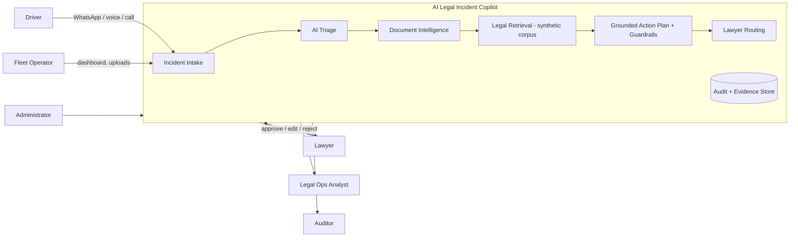
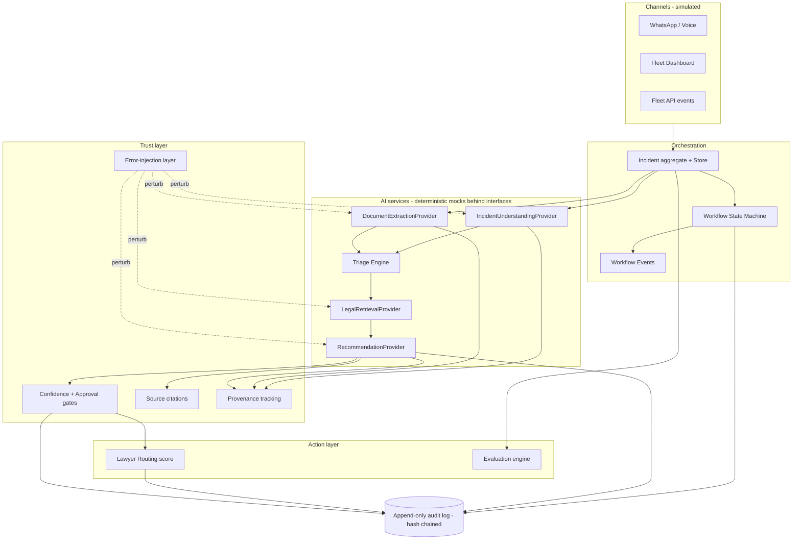
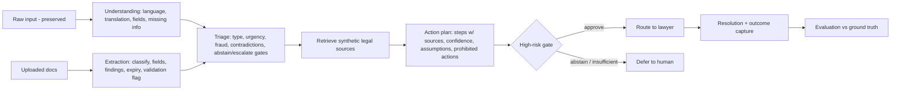
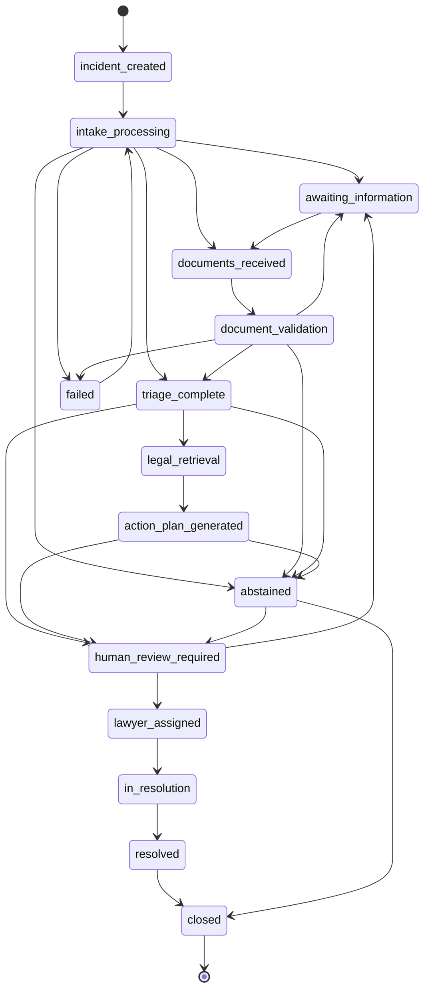
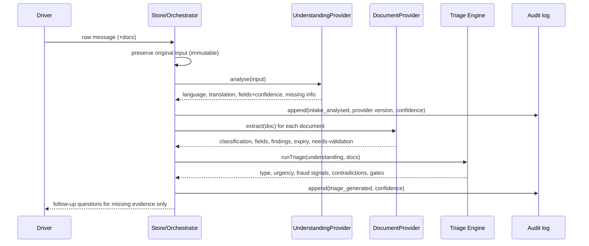
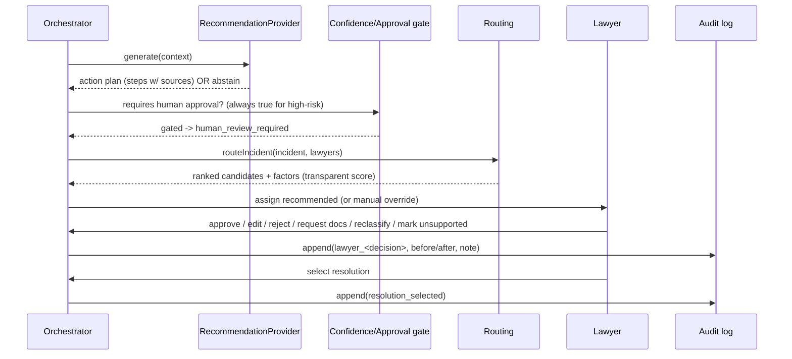
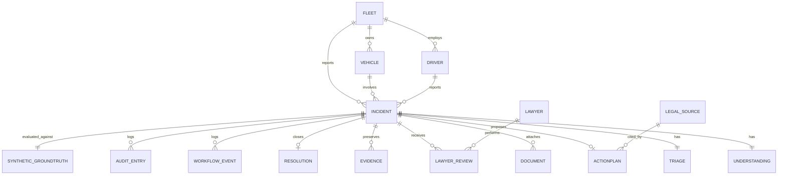
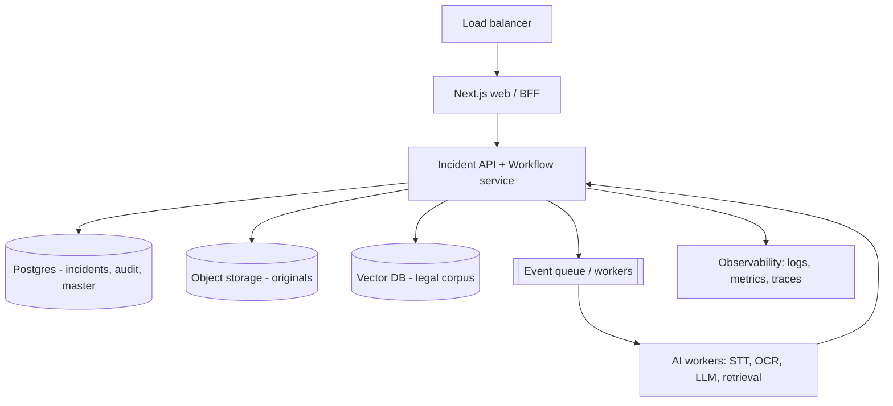

# System Design — AI Legal Incident Copilot

> Event-driven, retrieval-grounded, **human-supervised** architecture for mobility & fleet roadside incidents.
> This document describes the prototype as built, and marks where **production** behaviour would differ.

The product is a **legal-operations copilot**, not an autonomous lawyer. AI can draft, classify, retrieve and
recommend; high-risk legal actions cross a confidence gate and **require human (lawyer) approval**.

---

## 1. Context diagram



External systems that are **mocked** in the prototype (see §12): WhatsApp Business API, telephony, speech-to-text,
OCR, maps/geocoding, fleet-management systems, real LLM, vector DB, government challan/court sources, lawyer network.

---

## 2. Component diagram



Mapping to code:

| Component | Module |
|---|---|
| Domain types | `src/lib/types.ts` |
| Store (in-memory world + mutations) | `src/lib/store.ts` |
| State machine | `src/lib/workflow/machine.ts` |
| Triage engine | `src/lib/workflow/triage.ts` |
| Routing | `src/lib/workflow/routing.ts` |
| Provider interfaces | `src/lib/providers/interfaces.ts` |
| Deterministic mock providers | `src/lib/providers/mock.ts` |
| Error injection | `src/lib/providers/faults.ts` |
| Audit + hash chain | `src/lib/audit.ts` |
| Evaluation | `src/lib/evaluation/{engine,metrics}.ts` |
| RBAC | `src/lib/rbac.ts` |
| PII masking | `src/lib/pii.ts` |
| Synthetic data | `src/lib/data/*`, `src/lib/synthetic/schema.ts` |

---

## 3. Data-flow diagram (intake → resolution)



**Provenance rule:** the raw input, AI transcript, AI translation, extracted fields, and lawyer-reviewed record are
**distinct records**. AI derivations never overwrite the original (see `EvidenceRecord.provenance`).

---

## 4. Workflow state machine



Transitions are validated by `canTransition`; invalid transitions are **rejected** (`InvalidTransitionError`).
Idempotency and out-of-order handling: see §14.

---

## 5. Sequence — incident intake



## 6. Sequence — lawyer handoff



---

## 7. Database entities

The prototype uses a seeded **in-memory store** (see §11 for the production DB decision). The logical model:



Key entity fields are defined in `src/lib/types.ts` (`Incident`, `IncidentDocument`, `EvidenceRecord`,
`ActionPlan`, `LawyerReview`, `Resolution`, `WorkflowEvent`, `AuditEntry`, `Lawyer`, `LegalSource`).

---

## 8. Provider interfaces & retrieval

All AI is behind interfaces (`src/lib/providers/interfaces.ts`) so real providers can be plugged in:

```ts
interface IncidentUnderstandingProvider { analyse(input): Promise<IncidentUnderstanding> }
interface DocumentExtractionProvider   { extract(doc, incidentId): Promise<IncidentDocument> }
interface LegalRetrievalProvider       { retrieve(query): Promise<LegalSource[]> }
interface RecommendationProvider       { generate(context): Promise<ActionPlan> }
```

**Retrieval architecture (prototype):** deterministic filter over an 18-item synthetic corpus by incident type +
jurisdiction. **Production:** embed the (versioned) legal corpus into a vector DB; retrieve top-k with metadata
filters (jurisdiction, vehicle class, effective date); every action-plan step must cite ≥1 retrieved source or be
marked `unsupported`. Fabricated citations are caught by validating every citation id against the corpus (the
`hallucinated_citation` fault demonstrates the failure and the eval `fabricated_source` flag catches it).

---

## 9. Audit architecture

- Append-only log; each entry stores actor, role, action, before/after, source, reason, provider version, confidence,
  request id, and a **hash chained** to the previous entry (`prevHash` → `hash`).
- `verifyChain()` detects `broken_link` (prevHash mismatch) or `hash_mismatch` (content tamper). The Observability
  panel can *simulate* tampering to show the integrity check firing (`audit_log_gap`).
- There is **no delete API** — "delete audit history" is a modelled adversarial request that the system refuses.

---

## 10. Tenant isolation

Each incident carries a `fleetId`. Non-privileged roles (driver, fleet operator, legal ops) are scoped to their own
fleet via `visibleIncidents()`; only `admin`/`auditor` have `view_all_fleets`. The incident detail page enforces this
server-side of the store (renders an **Access denied** view for cross-fleet ids). Production would enforce the same
predicate at the query layer (row-level security / tenant-scoped queries) and in every API handler.

---

## 11. Deployment architecture

**Prototype:** a single Next.js (App Router) app. The synthetic world is hydrated in-memory in a client Zustand store;
all interactions (workflow stepping, lawyer decisions, routing, resolution, audit growth, fault toggles, role
switching) mutate that store. No database or external service is required — it runs from `npm install && npm run dev`.

> **DB decision.** The spec lists Postgres/Prisma or SQLite/Prisma as preferred. To guarantee the reliability
> requirement ("runs locally from documented commands" with zero setup), the prototype ships a **repository-style
> in-memory store seeded from typed fixtures** instead of a live DB. The store boundary (`src/lib/store.ts`,
> `src/lib/data/*`) is the swap point for Prisma + Postgres in production (see §12 and the ER model in §7).

**Production (target):**



---

## 12. Failure handling, retry, idempotency

- **Failure handling:** each provider call is wrapped; timeouts/malformed output raise typed errors
  (`ProviderTimeoutError`, `ProviderMalformedOutputError`) and drive the incident to `failed` (retryable) rather than
  silently proceeding. The workflow never advances past `human_review_required` without an assigned lawyer.
- **Retry strategy (production):** exponential backoff with jitter for transient provider errors; a capped retry
  budget per stage; a dead-letter path to a human queue.
- **Idempotency:** workflow transitions carry an `idempotencyKey`; duplicate events (the `duplicate_event` fault) are
  detected and ignored; out-of-order events (`out_of_order_event`) are rejected by the state machine.
- **Error injection** (`src/lib/providers/faults.ts`) lets you toggle 14 fault types from the Observability panel:
  ocr_digit_swap, missing_fields, incorrect_classification, overconfidence, missing_citations,
  hallucinated_citation, wrong_jurisdiction, delayed_response, provider_timeout, malformed_json, duplicate_event,
  out_of_order_event, stale_data, database_failure.

---

## 13. Scaling approach

Stateless web/API tier behind a load balancer; workflow orchestration and AI work moved to an event queue + worker
pool so long-running STT/OCR/LLM calls don't block request threads. Postgres with read replicas for dashboards;
object storage for originals; vector DB for retrieval. The evaluation engine runs as an offline/batch job over the
ground-truth corpus and regression set.

---

## 14. Security considerations

RBAC matrix (`src/lib/rbac.ts`) with 6 roles; per-field **PII masking** (`src/lib/pii.ts`) for phone/licence/Aadhaar
patterns, gated by role; tenant isolation (§10); append-only hash-chained audit (§9); export controls (only
`export_data` roles); consent/recording-legality warnings on evidence; retention labels. Production adds real
authN/authZ (OIDC/SSO), encryption at rest/in transit, secrets management, and least-privilege service accounts.

## 15. Observability

The in-app panel surfaces provider latency/error rate (simulated), workflow failures, retries, abstentions,
unsupported-output warnings, incidents stuck in a state, and audit-chain integrity. Production: structured logs,
metrics (per-stage latency, error rate, abstention rate, escalation recall), distributed tracing across the workflow,
and alerting on dangerous-failure signals.

## 16. Production risks

- **Legal correctness & liability** — synthetic sources must be replaced by a maintained, versioned, jurisdiction-aware
  legal corpus with expert review; the copilot must remain advisory with mandatory human approval.
- **Extraction/OCR error on safety-critical fields** — confident-but-wrong OCR (modelled) can misidentify vehicles;
  require human validation for high-impact fields.
- **Prompt injection via documents** — document content is data, never instructions; surfaced but never executed.
- **Calibration drift & over-trust** — monitor ECE and dangerous-failure rates continuously.
- **Privacy & jurisdiction of recordings** — recording legality varies; consent indicators and warnings are required.
- **Fraud & coordinated abuse** — integrity findings must route to a fraud-review queue, not auto-proceed.
```
